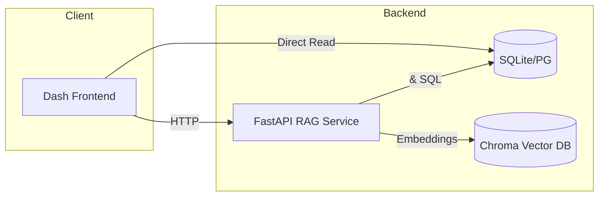

# ARGO Ocean Data Discovery & Visualization

<p align="center">
  
</p>

<p align="center">
  
  
  
  
  
</p>

A comprehensive platform for discovering, processing, and analyzing ARGO ocean float data. This project combines a **high-performance Indian Ocean data system**, an **interactive research dashboard**, and **FloatChat**—an AI-powered conversational interface for natural language data querying.

---

## 📖 About

The ARGO Ocean Data Discovery & Visualization platform is designed to make vast amounts of oceanographic data accessible and actionable. It specifically targets the **Indian Ocean region**, providing specialized tools to filter, store, and visualize float data with sub-second latency.

### System Architecture



### How It Works

1.  **Data Ingestion**: Processes raw global ARGO CSV data.
2.  **Geographic Filtering**: Automatically extracts floats within the Indian Ocean boundaries (20°E-120°E, 40°S-25°N).
3.  **Intelligent Processing**: Handles missing data with realistic filler generation based on regional parameters.
4.  **Storage**: Stores processed profiles in an optimized SQLite database for fast access.
5.  **Visualization**:
    *   **Dashboard**: Interactive maps and profile viewers options.
    *   **RAG AI**: Natural language queries converted to SQL or visualizations.

---

## 📁 Project Structure

ARGO Ocean Data Discovery & Visualization/
│
├── backend/                        # FastAPI RAG backend
│   └── rag_service.py              # Main API service
├── dash_frontend/                  # Frontend applications
│   ├── research_dashboard.py       # Main interactive dashboard
│   ├── simple_app.py               # Legacy/Simple interface
│   └── assets/                     # CSS and static assets
│
├── data/                           # Data storage
│   └── indian_ocean_floats.db      # Optimized SQLite database
│
├── src/                            # Core Python modules
│   ├── data_processor.py           # Core processing & filtering logic
│   ├── dashboard_data_integration.py # Bridge between DB and Dashboard
│   └── argo_float_rag.py           # RAG/LLM implementation
│
├── scripts/                        # Utility and setup scripts
│   ├── setup_indian_ocean_data.py  # Database initialization script
│   └── ingest.py                   # Data ingestion utilities
│
├── output/                         # Generated assets (plots, reports)
├── docs/                           # Documentation
├── requirements.txt                # Project dependencies
├── Dockerfile                      # Container configuration
└── README.md                       # This file
```

### Core Components

#### Data System (`src/data_processor.py`)
- **`IndianOceanArgoProcessor`**: Filters global data and creates the regional database.
- **`IndianOceanDataAccess`**: Provides optimized query methods (spatial, temporal, parametric).

#### Dashboard (`dash_frontend/`)
- **`research_dashboard.py`**: The primary UI for researchers, featuring map views, profile analysis, and regional filtering.

#### AI Assistant (`backend/` & `src/argo_float_rag.py`)
- **FloatChat**: A RAG-based assistant that allows users to ask questions like "Show me floats near Madagascar" and receive generated SQL or plots.

---

## ✨ Features

- ✅ **Indian Ocean Focus**: Specialized filtering for the Indian Ocean region.
- ✅ **High-Performance DB**: SQLite implementation with spatial indexing for sub-second queries.
- ✅ **Interactive Map**: Real-time float tracking with `scattergeo`/`mapbox`.
- ✅ **Profile Viewer**: Detail views for Temperature, Salinity, and Pressure profiles.
- ✅ **AI-Powered Chat**: Natural Language to SQL/Visualization using RAG.
- ✅ **Data Quality Control**: Automated validation and realistic filler for missing values.
- ✅ **Responsive Design**: Modern dashboard UI built with Dash.
- ✅ **Export Capabilities**: Export data to CSV, NetCDF, or GeoJSON.

---

## 🛠 Requirements

### Python Version
- Python 3.11 or higher

### Key Libraries
```bash
dash                # Web framework
plotly              # Interactive plotting
pandas              # Data manipulation
fastapi             # Backend API
chromadb            # Vector database for RAG
sentence-transformers # Text embeddings
geopandas           # Spatial data handling
sqlalchemy          # Database ORM
```

---

## 🚀 Installation

### Step 1: Clone the Repository
```bash
git clone <repository-url>
cd "ARGO Ocean Data Discovery & Visualization"
```

### Step 2: Set Up Environment
```bash
python -m venv venv
source venv/bin/activate  # On Windows: venv\Scripts\activate
```

### Step 3: Install Dependencies
```bash
pip install -r requirements.txt
```

### Step 4: Initialize Data
Run the setup script to process the data and create the local database.
```bash
python scripts/setup_indian_ocean_data.py
```
*Note: This will look for ARGO CSV data. You can specify a custom path using `--csv-path`.*

---

## 💻 Usage

### 1. Research Dashboard (Recommended)
The main interface for data exploration.
```bash
python dash_frontend/research_dashboard.py
```
> **Access at**: `http://localhost:8050`

### 2. FloatChat (AI Assistant)
To run the full RAG system:

**Terminal 1 (Backend):**
```bash
uvicorn backend.rag_service:app --reload
```

**Terminal 2 (Frontend):**
```bash
BACKEND_URL=http://localhost:8000 python dash_frontend/simple_app.py
```

---

## ⚙️ Configuration

### Database Settings
The system defaults to using a local SQLite database in `data/indian_ocean_floats.db`. You can customize this in `dashboard_data_integration.py`.

### Environment Variables
Create a `.env` file for advanced configuration:
```env
DATABASE_URL=sqlite:///data/indian_ocean_floats.db
AUTH_TOKEN=your-dev-token
MAPBOX_TOKEN=your-mapbox-token-optional
```

---

## 🧠 Technical Details

### Database Schema
The core `profiles` table is optimized for scientific queries:

```sql
CREATE TABLE profiles (
    id INTEGER PRIMARY KEY,
    float_id TEXT,
    datetime TEXT,
    latitude REAL,
    longitude REAL,
    depth REAL,
    temperature REAL,
    salinity REAL,
    -- ... indexes on lat/lon, time
);
```

### RAG Pipeline
1.  **Query Analysis**: Determines if the user is asking for SQL data, general info, or a plot.
2.  **Retrieval**: Fetches relevant schema info and summary stats from ChromaDB.
3.  **Generation**: LLM constructs the SQL query or Plotly specification.
4.  **Execution**: Runs the query against the database and returns results.

---

## 🔧 Troubleshooting

### Database Not Found
```
Error: Database file not found at ...
```
**Solution**: Run `python setup_indian_ocean_data.py` to generate the database first.

### Missing Dependencies (GeoPandas)
If you encounter errors installing `geopandas` or `shapely`, ensure you have system libraries installed (e.g., `libgeos-dev` on Linux).

### Port Conflicts
If port 8050 or 8000 is in use, you can specify a distinct port in the run commands:
```bash
python dash_frontend/research_dashboard.py --port 8051
```

---

## 📈 Future Improvements

- [ ] Selectable date ranges for animations
- [ ] Integration of live ARGO API feed
- [ ] 3D visualization of ocean profiles
- [ ] Comparison tool for multi-float analysis
- [ ] Advanced anomaly detection models

---

## 📚 References

- **Argo Program**: [https://argo.ucsd.edu](https://argo.ucsd.edu)
- **Dash Documentation**: [https://dash.plotly.com](https://dash.plotly.com)
- **FastAPI**: [https://fastapi.tiangolo.com](https://fastapi.tiangolo.com)

---

## 📄 License

This project is available under the MIT License.

---

## ⚠️ Disclaimer

This tool is for research and educational purposes. Data fillers used for missing values are statistically generated for testing and should be verified against official sources for publication.
